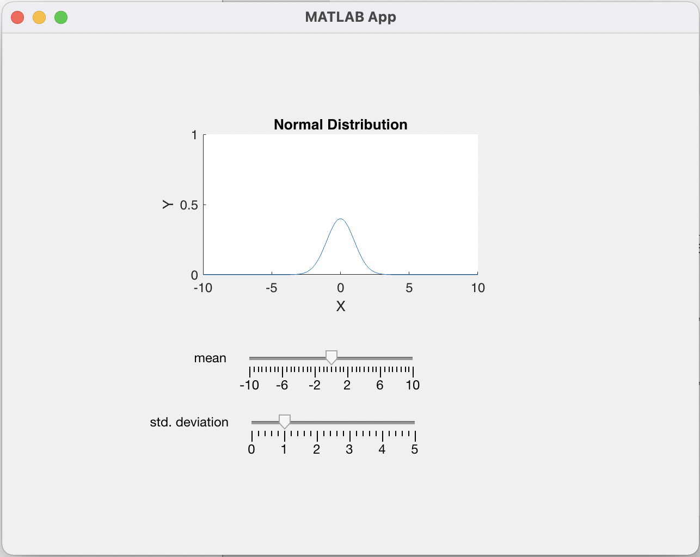

# Laboratory Activity - App Designer Exercise

Develop a program that can plot the graph of normal distribution interactively as shown in the figure:

The normal distribution can be expressed as:

<!-- $
p(x) = \frac{1}{\sigma\sqrt{2\pi}} e^{-0.5 (\frac{x - \mu}{\sigma})^2}
$ --> 

<!-- 

 

 -->

## Functionality
1. Upon the start of the app (startupFcn), it should automatically display the normal distribution curve on the figure.
    - Default value of mean is 0, while std. deviation is 1
    - YLim of UIAxes is fixed from 0 to 1
    - XLim of UIAxes is fixed from -10 to 10
    - The title is "Normal Distribution"

2. The figure must be updated automatically after sliding the meanSlider (meanSliderValueChanged)
3. The figure must be updated automatically after sliding the stddeviationSlider (stddeviationSliderValueChanged)

## Variable Name Convention:

| Name | Description |
| ---- | ----------- |
| meanSlider | Describes the slider for changing the value of mean |
| stddeviationSlider | Describes the slider for changing the value of std. deviation | 
| UIAxes | It handles the display of the figure |
| app.x | Handles the arrays of x | 
| app.p | Handles the calculated y for each element in app.x |

## How to upload in MATLAB Online
There are two links you need to remember:
- [matlab.mathworks.com](https://matlab.mathworks.com) - navigates you to MATLAB Online
- [drive.matlab.com](https://drive.matlab.com/) - navigates to the files you use for MATLAB Online. This is the same files you see on the left tab of MATLAB Online. Think of it like Google Drive.

What you need to do is to upload it on MATLAB Drive. You will then be able to see in MATLAB Online.
1. On this Github page > Code > Download as Zip
2. Extract Zip File into a folder
3. On MATLAB Drive, Click on Upload > Folder
4. Select the generated folder from Step 2
5. Navigate to MATLAB Online. You should be see the folder on the left tab
6. Double-Click the file **normalApp.mlapp**
7. Enjoy Coding

## How to Check Your Work
1. Click on TEST Button then WAIT
2. If the test is successful, you are ready to submit your work. Please ask your instructor for more details on submission
3. If the test fails, navigate to MATLAB's command window and read the error message. Please ask for assistance if you can't understand the error.